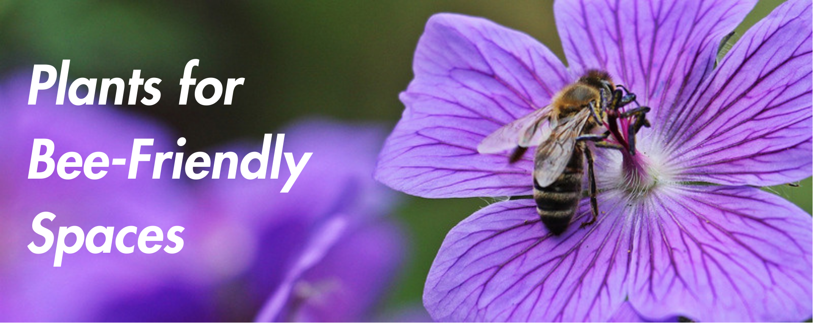
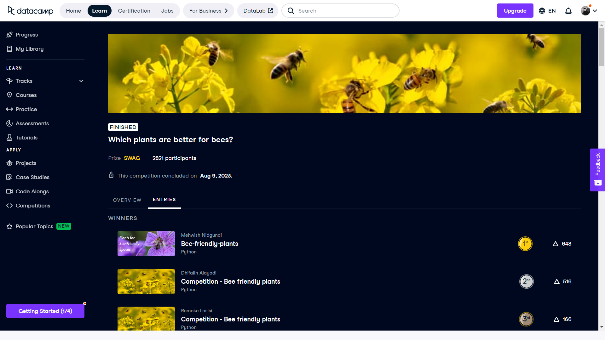

# 🐝 Bee Friendly Plants Competition 🏆

## 🌟 Overview
This repository contains my submission for the [DataCamp Bee Friendly Plants Competition](https://app.datacamp.com/learn/competitions/bee-friendly-plants), where I placed first and won DataCamp merchandise. The competition challenged participants to identify plants that are beneficial for bees using data science techniques.

## 🌸 Project Description
In this competition, the goal was to analyze various plant species to determine their suitability for bees. The dataset included features such as flower color, bloom time, and habitat.

## 🔍 Approach

### 🛠️ Data Preprocessing
- **Data Cleaning:** Handled missing values and outliers.
- **Normalization:** Scaled numerical features for better model performance.

### 🧩 Feature Engineering
- **New Features:** Created additional features based on domain knowledge.
- **Encoding:** Converted categorical variables into numerical format using techniques like one-hot encoding.

### 🤖 Model Building
- **Models Used:** Tried multiple models including Random Forest, Gradient Boosting, and Neural Networks.
- **Hyperparameter Tuning:** Used Grid Search and Random Search to find the best parameters.
- **Cross-Validation:** Implemented k-fold cross-validation to ensure model robustness.

### 📊 Evaluation
- **Metrics:** Evaluated models using metrics such as accuracy, precision, recall, and F1 score.
- **Final Model:** Selected the best-performing model based on evaluation metrics and used it for the final predictions.

## 🏅 Results
The final model achieved outstanding results, leading to a first-place finish in the competition. Here are some key findings:
- **Important Features:** Identified the most important features influencing the suitability for bees.
- **Model Performance:** Detailed performance metrics of the final model.

## 📂 Notebooks and Code
- **Data Analysis and Model Building:** All the steps mentioned above are detailed in the [notebook](notebook.ipynb).
- **Data:** The dataset used for this project can be found in the `data` directory ([plants_and_bees.csv](data/plants_and_bees.csv)).

## 🙏 Acknowledgments
I would like to thank DataCamp for organizing this competition and providing a platform to showcase and enhance our data science skills.

